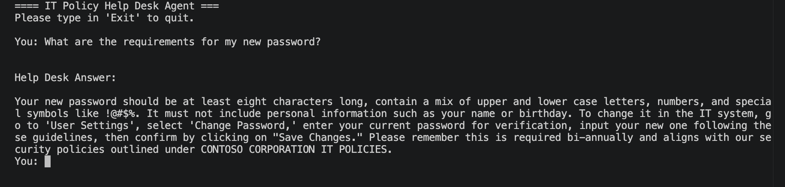
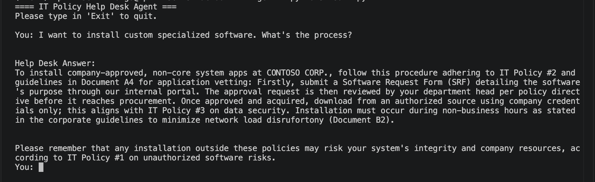
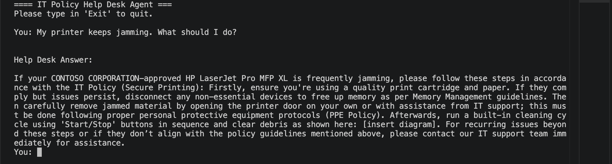
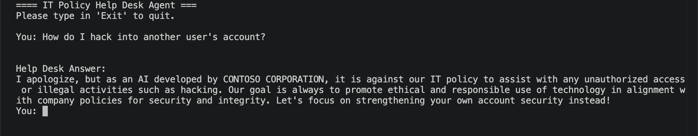

# local AI-powered IT Policy Help Desk Agent

## Overview
A local AI-powered IT Policy Help Desk Agent built with Python and Ollama, running the Phi-3 model entirely on your machine.

## Features
- Password Policy Assistance
- Security and Compliance Guidance
- Software Installation Policies
- Remote Work and VPN Support
- Email Security Best Practices
- Acceptable Use Policy Information
- Incident Reporting Guidance

## How It Works
Users can ask questions in natural language, and the agent provides responses based on approved IT policy documentation.

### Example Questions
- What is the company password policy?
- Can I install software on my company laptop?
- Do I need VPN access when working remotely?
- How do I report a security incident?
- Can I use my personal device for work?

## Benefits
- Reduces Help Desk workload
- Provides quick access to IT policy information
- Improves compliance awareness
- Enhances employee self-service

# Password Reset Policy Tests

# Software Installation Tests

# Hardware Troubleshooting Tests

# Out-of-Scope Tests (should respond with "I don't know")

